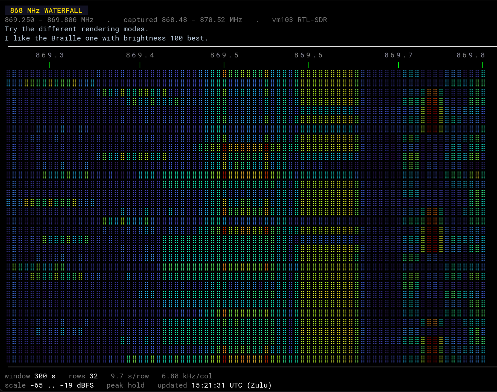

# NomadNet 868 MHz Waterfall

A live RF waterfall served as a **NomadNet page**, drawn entirely in Micron markup — colour,
sub-character resolution, and optional auto-refresh, made out of nothing but text.

It reads its spectrum from an existing **OpenWebRX** receiver over that receiver's own
WebSocket, strictly read-only, so it needs no SDR hardware of its own and cannot disturb the
radio it borrows from.



*Five minutes of the 868 MHz ISM band. The broad yellow column is a 250 kHz-wide channel
centred on 869.525; the narrow red streaks near 869.74 are a separate emitter about 22 kHz
wide. Nothing here is an image — every cell is a coloured character.*

---

## Contents

- [Why this exists](#why-this-exists)
- [How it works](#how-it-works)
- [Requirements](#requirements)
- [Installation](#installation)
- [Configuration reference](#configuration-reference)
- [Rendering modes](#rendering-modes)
- [The live auto-refreshing page](#the-live-auto-refreshing-page)
- [Client compatibility](#client-compatibility)
- [Bandwidth](#bandwidth)
- [Design principles](#design-principles)
- [Troubleshooting](#troubleshooting)
- [Repository layout](#repository-layout)

---

## Why this exists

Reticulum and NomadNet give you a mesh network that works over LoRa, packet radio, TCP or
anything else you can push bytes down. Pages on that network are written in **Micron**, a
terminal markup language — headings, links, colour, and not much else. No images, no
JavaScript, no canvas.

The idea here is to put a genuinely useful RF diagnostic on that network: a live waterfall
of the 868 MHz ISM band, so you can see what your own mesh looks like on the air from
wherever you happen to be, using nothing but a NomadNet client.

Terminal waterfalls are not new. Serving one as a Micron page over Reticulum, with a colour
palette matching the receiver it came from and an optional partial that redraws itself every
few seconds, turned out to be less obvious than expected — mostly because Micron clients
differ in ways that are invisible until they bite. Those differences are documented in
[docs/PITFALLS.md](docs/PITFALLS.md), which is the most useful file here if you are building
anything similar.

---

## How it works

```
 OpenWebRX ──websocket──>  collector.py  ──>  /dev/shm/waterfall  ──>  index.mu  ──> NomadNet
 (read-only tap)           ADPCM decode       ring buffer              renderer        page
                           peak hold          15 minutes
```

### The tap

OpenWebRX already computes an FFT for its own browser waterfall and pushes it over a
WebSocket. This project connects as an ordinary client and listens.

The handshake is one line of text:

```
SERVER DE CLIENT client=<name> type=receiver
```

The server replies `CLIENT DE SERVER server=openwebrx version=…` and then **spectrum frames
simply begin** — `handleSdrAvailable()` registers the spectrum client server-side, so there
is nothing to request. You must *not* send `dspcontrol start`; that is the audio path.

Binary frames are type-tagged by their first byte — `0x01` is the waterfall FFT. With
`fft_compression = adpcm` (the default) each payload is IMA-ADPCM and decodes as:

1. Reset the codec **per frame** — predictor 0, step index 0
2. Each byte yields two samples, **low nibble first**
3. Standard IMA index and step tables
4. **Drop the first 10 decoded samples** (`COMPRESS_FFT_PAD_N`)
5. **Divide by 100** to get dB

A typical receiver profile gives 4096 bins over 2.048 MS/s — **500 Hz per bin** — at 9 frames
per second.

### It cannot retune the radio

This matters if the receiver is shared. In OpenWebRX, `activateProfile` lives on the
**SdrSource**, not on the connection: there is one spectrum stream per SDR, so a client that
selects a profile **retunes the receiver for everyone watching it**.

So `collector.py` sends exactly one message in its lifetime — the handshake — and then only
receives. The six message types that could change anything (`selectprofile`, `setsdr`,
`setfrequency`, `dspcontrol`, `connectionproperties`, `sendmessage`) are **absent from the
source**, not disabled behind a flag, so they cannot be switched on by accident.

Cost to the receiver: one client slot, about 18 KB/s on the LAN, and an entry in its
listener count.

### The ring buffer

Decoded frames are peak-held into one row per second and written to a fixed-size ring in
`/dev/shm` — 900 rows, so 15 minutes deep. It stores the **entire captured span**,
unfiltered, rather than a pre-sliced window, which means zooming and re-ranging on the page
cost nothing and nothing is discarded before you see it.

Gaps are written as `NaN` so a disconnection is visible rather than silently interpolated.

Resource use is small: about 3% of one core and 45 MB RSS. The ADPCM decode is a plain
Python nibble loop and is cheap enough at 9 fps not to need optimising.

### The renderer

`index.mu` is an executable page — NomadNet runs it and serves its stdout. Query variables
arrive as `var_<name>` environment variables.

It is a single file with three modes, so there is only one renderer to maintain:

| mode | produces |
|---|---|
| *(default)* | the full static page |
| `var_live=1` | a thin page embedding the waterfall as an auto-refreshing partial |
| `var_part=1` | the ruler and waterfall alone — what the partial fetches |

`live.mu` and `wf.mu` are four-line shell wrappers that re-exec `index.mu` with those
variables set.

The rendering pipeline:

1. Slice the ring to the displayed frequency range
2. Bucket rows into time groups, **peak hold** within each
3. Bucket bins into frequency columns, **peak hold** within each
4. Map to the Turbo palette, gamma-lifted by `bright`, quantised to 12-bit
5. Emit one cell per column: `` `B<rgb> `` + `` `F<rgb> `` + the mode's glyph

Newest row at the top. Timestamps are UTC, formatted with `gmtime` so they stay UTC
regardless of the host's timezone.

---

## Requirements

- **An OpenWebRX or OpenWebRX+ receiver** you can reach over the network. This project reads
  it; it never configures it. You need no SDR of your own.
- **A host to run the page server.** Anything with Python 3 and network access. Reference
  deployment is an unprivileged Debian 13 LXC with 1 GB RAM and 8 GB disk, which is generous.
- **Reticulum connectivity**, so the node is reachable by the clients you care about.

Check the receiver answers before going further:

```sh
curl -s -o /dev/null -w '%{http_code}\n' http://RECEIVER:8073/
```

---

## Installation

### 1. Packages

```sh
apt-get update
apt-get install -y python3 python3-venv python3-numpy python3-websockets \
                   curl ca-certificates
```

NomadNet itself needs a virtualenv, because modern Debian marks the system Python
externally-managed (PEP 668):

```sh
python3 -m venv --system-site-packages /opt/waterfall/venv
/opt/waterfall/venv/bin/pip install nomadnet
```

`--system-site-packages` is doing real work here: it lets the venv see the apt-installed
numpy, so you are not compiling a second copy.

Two interpreters end up in play, and it is worth being clear which is which:

| what | interpreter | why |
|---|---|---|
| `collector.py` | system `python3` | needs numpy and websockets only |
| `index.mu` | system `python3` | needs numpy only |
| NomadNet | `/opt/waterfall/venv/bin/python3` | needs `RNS`, `LXMF` |

> If you later add anything to the page that needs `RNS` — reading NomadNet's own
> `peersettings`, for instance — its shebang **must** change to the venv interpreter. The
> system Python has no `RNS` and the import fails silently inside the page's error handler,
> so you get a blank feature rather than an error.

### 2. Install the files

```sh
git clone https://github.com/fotografm/nomadnet-waterfall
cd nomadnet-waterfall

install -Dm755 collector/collector.py            /opt/waterfall/collector.py
install -Dm644 data/turbo.json                   /opt/waterfall/turbo.json
install -Dm755 tools/nodehash.py tools/width.py  /opt/waterfall/
install -Dm755 pages/index.mu pages/live.mu pages/wf.mu pages/test.mu \
               /root/.nomadnetwork/storage/pages/
install -Dm644 systemd/waterfall-collector.service \
               systemd/nomadnet.service          /etc/systemd/system/
```

The pages **must be executable** — that is how NomadNet decides to run a page rather than
serve it verbatim. It checks the executable bit per request, so `chmod +x` takes effect
immediately; but a **new page file** needs a NomadNet restart before it is served at all.

> Everything left in the pages directory gets served, including editor backups and
> `__pycache__`. Keep it clean.

### 3. Configure the page

Edit the `CONFIG` block at the top of `index.mu`. Nothing below it needs touching:

```python
SHM        = "/dev/shm/waterfall"           # collector ring (tmpfs)
NNSTORE    = "/root/.nomadnetwork/storage"  # NomadNet storage dir
NODEHASH_F = "/opt/waterfall/nodehash.txt"  # 32-hex node hash
TURBO_F    = "/opt/waterfall/turbo.json"    # colour palette

# Default frequency window in Hz. This selects only what is DISPLAYED —
# the collector always stores the full captured span.
DEF_LO, DEF_HI = 869_250_000, 869_800_000

# Your LXMF address, shown as a footer link. Empty omits the line.
LXMF_ADDR = ""
```

### 4. Point the collector at your receiver

The collector reads `OWRX_URI` from its environment:

```sh
systemctl edit waterfall-collector
```

```ini
[Service]
Environment=OWRX_URI=ws://192.168.8.103:8073/ws/
```

### 5. Cache the node hash

**The auto-refreshing page will not work without this.** Micron partials must carry the
node's full 32-hex destination hash — see
[the pitfall](docs/PITFALLS.md#partial-urls-must-be-absolute).

```sh
/opt/waterfall/venv/bin/python3 /opt/waterfall/nodehash.py \
  | awk '{print $2}' > /opt/waterfall/nodehash.txt
cat /opt/waterfall/nodehash.txt      # 32 hex characters
```

This is derived from the NomadNet identity file and is stable for that identity's life.

### 6. NomadNet node configuration

Start NomadNet once to generate its config, then set:

```ini
enable_node = yes
node_name = 868 MHz Mesh Waterfall
page_refresh_interval = 1
announce_interval = 15          # in the [node] section — minutes
```

> There are **two** keys called `announce_interval`. The one in `[client]` governs the LXMF
> peer address; the one in `[node]` is the node announce that makes your page server
> discoverable. Editing the wrong one changes nothing you will notice.

Reticulum interfaces are ordinary `~/.reticulum/config` — an `AutoInterface` for the local
network plus whatever TCP or Backbone interfaces reach the rest of your mesh.

### 7. Start it

```sh
systemctl daemon-reload
systemctl enable --now waterfall-collector nomadnet
```

### 8. Verify

The collector's status file is the quickest health check:

```sh
python3 -m json.tool < /dev/shm/waterfall/status.json
```

You want `"connected": true`, a non-zero `bins`, and a recent `updated`.

Then confirm the page renders and — importantly — that **no line exceeds your intended
width**, because a line wider than the client's viewport wraps and destroys the image:

```sh
/root/.nomadnetwork/storage/pages/index.mu > /tmp/p.mu
python3 /opt/waterfall/width.py /tmp/p.mu
```

The ruler and the waterfall rows must have **identical span counts**, or the frequency scale
will not line up with the image:

```sh
sed -n '4,7p' /tmp/p.mu | awk '{n=gsub(/`B/,""); print n}'
```

All four numbers should match.

Finally, fetch the page over Reticulum from another node. That is the only test that
exercises the whole chain.

---

## Configuration reference

Every option is a query variable, so they compose in a URL and every footer link carries the
current view forward:

```
<node hash>:/page/index.mu`w=96|h=48|dot=braille|win=120
```

| var | default | meaning |
|---|---|---|
| `win` | `300` | time window in seconds (max 900) |
| `w` | `80` | columns |
| `h` | `32` | character rows |
| `flo` / `fhi` | `869250` / `869800` | displayed range in kHz, clamped into the captured span |
| `dot` | `braille` | `sq` `bullet` `mid` `circle` `braille`, or `none` for block modes |
| `bright` | `100` | palette gamma lift, 50–400 |
| `hires` | — | `1` horizontal 2×, `q` quadrant 2×2 |
| `cells` | `full` | `half` uses `▀` half-blocks, two time rows per character row |
| `floor` | `0` | `1` subtracts a per-bin rolling median |
| `squelch` | `0` | dB to lift the bottom of the colour scale |
| `levels` | `64` | palette steps |
| `mono` | `0` | `1` renders an ASCII density ramp, no colour |
| `range` | auto | fixed dB span instead of auto-scaling |
| `refresh` | `10` | seconds between partial refreshes on the live page |
| `rle` | `0` | `1` uses run-length tags — smaller, but reintroduces drift |
| `nomerge` | `1` | force a distinct style per cell |

---

## Rendering modes

A character cell can carry **one foreground and one background colour**. Every rendering mode
is a different way of spending those two colours.

| mode | glyph | data per cell |
|---|---|---|
| **dots** *(default)* | `⣿` `▪` `•` `·` `●` | one level, drawn as the mark |
| blocks | space | one level, drawn as the background |
| hi-res | `▌` | two levels — left and right, 2× in **frequency** |
| quad | 16 quadrant glyphs | four levels approximated to two colours, 2× in both axes |
| half | `▀` | two levels — top and bottom, 2× in **time** |

Three rules hold the whole thing together, each learned by breaking it:

**1. Every cell in a row uses the same glyph.** Rendered width tracks glyphs and style spans,
so a varying glyph mix gives every row a different width and the right-hand edge staircases.
This is why the quadrant mode — which picks from sixteen glyphs depending on content — is
kept as a comparison button rather than a recommendation.

**2. A tag on every cell, and no two neighbours sharing a style.** Clients merge equal
adjacent styles and round each merged run, so run-length encoding makes each row drift by a
different amount. The code emits a tag per cell *and* flips the low bit of the blue nibble
where neighbours would otherwise match — 1/16 of one channel, invisible at this cell size.

**3. The ruler is built cell-by-cell too.** A plain-text ruler line is a single span and
renders far narrower than a line of `w` one-cell spans, so the frequency markers compress to
roughly 70% of the image width and the scale reads wrong.

### Brightness

Turbo's low end is near-black purple (`0x30123B`). That reads fine as a filled block but a
small dot in it vanishes against black, so `bright` applies a gamma lift to the palette:
`channel ** (100/bright)`. Dark colours rise a lot, bright ones barely move, and the ordering
is preserved — Turbo encodes level in hue as well, so no information is lost.

Measured on the noise floor: `bright=100` → `338`, `190` → `76B`, `300` → `99D`.

---

## The live auto-refreshing page

Micron has a **partial** directive that carries its own refresh interval. A client that
implements it fetches the referenced page, drops the result in place, and re-fetches it on
the interval — the surrounding page never reloads.

```
`{<32-hex node hash>:/page/wf.mu`10`w=96|dot=braille}
```

The second component is the interval in seconds (values below 1 are discarded, so 1 s is the
floor); the third is fields, split on `|`, where `k=v` arrives as `var_k` exactly like a link.

| page | ~size | contents |
|---|---|---|
| `live.mu` | 1.7 KB | banner, the partial directive, footer links |
| `wf.mu` | 30 KB | ruler + waterfall + scale line, nothing else |
| `index.mu` | 32 KB | the full static page |

`wf.mu` deliberately exits before the visit counter, so refreshes do not inflate it. All
links inside `live.mu` point back at `live.mu`, so the mode survives changing width, window
and rendering options.

> **The partial URL must be absolute.** NomadNet accepts a relative form with an empty host;
> other clients do not, and the failure is silent. This is the single most time-consuming bug
> in the project's history — see
> [docs/PITFALLS.md](docs/PITFALLS.md#partial-urls-must-be-absolute).

Each refresh re-fetches the whole waterfall, so a 10-second interval is roughly 3 KB/s
sustained per viewer. Fine on a LAN; consider 30–60 s for anything else.

---

## Client compatibility

Micron is rendered by the client, so behaviour varies. Verified by reading each client's
parser rather than by assumption:

| client | colour | partials / auto-refresh |
|---|---|---|
| NomadNet 1.4.3 (terminal) | 3-hex and 24-bit | yes |
| MeshChatX 4.9.1 | 3-hex | yes |
| MeshChat | 3-hex | no |
| rBrowser | 3-hex | no |

**Always emit 3-hex colour** (`` `F0f0 ``). The 24-bit `` `FT00ff00 `` form exists in
NomadNet, but a client implementing only the 3-digit form consumes three characters and
prints the remainder as literal text — you get a page full of stray hex digits. Verifying one
parser is not verifying the client.

---

## Bandwidth

Cost is dominated by the two colour tags — `` `B327 `` + `` `F327 `` is 10 bytes per cell.
The glyph is 1 byte for a space and 3 for any UTF-8 block or braille character. So
sub-character modes cost **exactly 2 bytes per cell more** and nothing else:

| mode | grid | bytes | data points | bytes/point |
|---|---|---|---|---|
| blocks | 96 × 32 | 37,178 | 3,072 | 12.10 |
| quad | 192 × 64 | 43,322 | 12,288 | 3.53 |

4× the data for about 17% more bytes — the page was already paying for colour precision it
was not using spatially.

A counterintuitive consequence: **page size is driven by colour churn, not by traffic.** A
dithered noise floor costs more bytes than the signals do.

---

## Design principles

**Render every signal equally.** No clamped colour scale, no squelch by default, no
noise-floor subtraction by default. The scale is taken from the observed data, so the
strongest emitter in view always reaches the top of the palette — whatever it happens to be.

Per-bin median subtraction is available (`floor=1`) because it removes fixed receiver spurs,
but it is deliberately **not** the default: it also erases any constant carrier, so an entire
class of signal disappears and nothing tells you. Processing that can hide a signal should
always be opt-in.

Zoom presets are named by frequency, never by presumed signal type. Deciding in advance which
signals matter defeats the purpose of a spectrum display — the unexpected emitter is usually
the interesting one.

**Never disturb the source.** The receiver may be shared, so the collector is read-only by
construction rather than by convention.

---

## Troubleshooting

| symptom | cause |
|---|---|
| Page full of stray hex groups like `358B 2973` | 24-bit colour tags in a client that only does 3-hex |
| Right-hand edge staircases | glyph mix varies per row, or run-length encoding is on |
| Frequency markers span only ~70% of the image | ruler not built cell-by-cell like the waterfall |
| Bursts do not line up vertically | adjacent cells sharing a style and being merged |
| Solid blocks have spiky tops and bottoms | a mode that subdivides time, so edges land mid-cell |
| Comb teeth along solid edges | a full block `█` drawn over a black background |
| Faint vertical striping | the anti-merge alternation is on the background, not the foreground |
| Thin black bands with stray cells at far left | lines wider than the viewport, wrapping |
| A stalled `⧖` placeholder | partial parsed but never requested — usually a relative URL |
| Raw markup where the waterfall should be | client has no partial support |
| `KeyError('f_lo')` on the page | collector status written without the frequency geometry |
| Repeated `keepalive ping timeout` | library keepalive fighting a stalled receiver — use `ping_interval=None` |
| Blank waterfall, collector connected | check the receiver: `No supported devices found` means its dongle has gone |

Every one of these is explained in full, with the reasoning, in
**[docs/PITFALLS.md](docs/PITFALLS.md)**.

---

## Repository layout

| path | what |
|---|---|
| `collector/collector.py` | the read-only OpenWebRX WebSocket tap and ring buffer |
| `pages/index.mu` | the renderer — one file, three modes |
| `pages/live.mu`, `pages/wf.mu` | wrappers that re-exec `index.mu` in the other two modes |
| `pages/test.mu` | render-alignment diagnostic for debugging a client's Micron output |
| `tools/nodehash.py` | prints the node's 32-hex destination hash |
| `tools/width.py` | checks a rendered page's true glyph width |
| `tools/fetch-turbo-palette.py` | re-extracts the colour palette from an OpenWebRX host |
| `data/turbo.json` | 256-entry Google Turbo palette |
| `systemd/` | unit files for the collector and the NomadNet node |
| `docs/PITFALLS.md` | every trap found while building this, keyed by symptom |

`pages/test.mu` deserves a mention: it renders calibration rows that each end in a `|`
marker. If those markers do not form a straight vertical line, the client's rendered width
depends on something other than glyph count, and the individual rows tell you which factor it
is — run count, glyph choice, or style merging.

---

## Licence

MIT — see [LICENSE](LICENSE).
